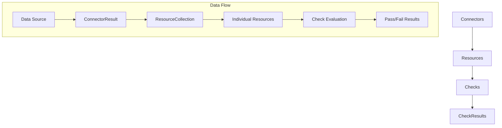

# System Flow Documentation

## Overview

This system is built around three core modules that work together to fetch, validate, and evaluate resources:

- **Connectors**: Fetch data from various sources
- **Resources**: Represent individual data items
- **Checks**: Evaluate resources against configured criteria

## System Architecture



## Module Breakdown

### 1. Connectors Module (`connectors/`)

**Purpose**: Fetch data from external sources and convert it into resources.

#### Key Models:

**`ConnectorConfig`**
- Configures how a connector connects to its data source
- Contains credentials, endpoints, timeouts, retry settings
- Supports multiple connector types: API, Database, File, Cloud, Custom

**`BaseConnector` (Abstract)**
- Defines the interface all connectors must implement
- Key methods:
  - `fetch()`: Returns `ConnectorResult` with multiple resources
  - `validate_config()`: Ensures connector is properly configured
  - `test_connection()`: Verifies connectivity

**`ConnectorResult`**
- Contains the fetched data as a list of raw resource dictionaries
- Includes metadata, execution time, error information
- Provides success/failure status

#### Example Flow:
```python
# 1. Configure the connector
config = ConnectorConfig(
    name="user_api",
    connector_type=ConnectorType.API,
    endpoint="https://api.example.com/users",
    headers={"Authorization": "Bearer token"}
)

# 2. Create and execute connector
connector = APIConnector(config)
result = connector.fetch()

# 3. Result contains raw resource data
# result.resources = [
#     {"id": "1", "name": "John", "email": "john@example.com"},
#     {"id": "2", "name": "Jane", "email": "jane@example.com"}
# ]
```

### 2. Resources Module (`resources/`)

**Purpose**: Represent individual data items that checks will evaluate.

#### Key Models:

**`Resource`**
- Fundamental unit that represents a single data item
- Contains structured data with metadata, tags, and status
- Provides methods for field access using dot notation
- Tracks creation/update timestamps

**`ResourceField`**
- Represents individual fields within a resource
- Supports type validation and constraints
- Can be marked as required with validation rules

**`ResourceCollection`**
- Groups multiple resources together
- Provides filtering, searching, and collection management
- Typically created from `ConnectorResult`

#### Example Flow:
```python
# 1. Convert ConnectorResult to ResourceCollection
resources = []
for raw_data in connector_result.resources:
    resource = Resource(
        id=raw_data["id"],
        source_connector="user_api",
        data=raw_data,
        status=ResourceStatus.ACTIVE
    )
    resources.append(resource)

collection = ResourceCollection(
    resources=resources,
    source_connector="user_api",
    total_count=len(resources)
)

# 2. Access resource data
user_resource = collection.get_by_id("1")
email = user_resource.get_field_value("email")  # "john@example.com"
```

### 3. Checks Module (`checks/`)

**Purpose**: Evaluate resources against configured criteria.

#### Key Models:

**`Check`**
- Defines a single validation rule
- Specifies field path, comparison operation, and expected value
- Supports all comparison operations: `==`, `<`, `>`, `contains`, custom functions

**`ComparisonOperation` (Enum)**
- Defines all supported comparison types
- Includes standard operations and custom function support

**`CheckResult`**
- Contains the outcome of a check evaluation
- Includes actual vs expected values, pass/fail status
- Captures error information if evaluation fails

#### Example Flow:
```python
# 1. Define checks
email_check = Check(
    name="valid_email_domain",
    field_path="email",
    operation=ComparisonOperation.CONTAINS,
    expected_value="@company.com"
)

age_check = Check(
    name="minimum_age",
    field_path="profile.age",
    operation=ComparisonOperation.GREATER_THAN,
    expected_value=18
)

# 2. Run checks on individual resources
for resource in collection:
    email_result = email_check.evaluate(resource.data)
    age_result = age_check.evaluate(resource.data)
    
    if email_result.passed and age_result.passed:
        print(f"Resource {resource.id} passed all checks")
    else:
        print(f"Resource {resource.id} failed checks")
```

## Complete System Flow

### Step 1: Data Fetching
```python
# Configure and create connector
config = ConnectorConfig(name="api", connector_type=ConnectorType.API, endpoint="...")
connector = APIConnector(config)

# Fetch data
connector_result = connector.fetch()
# connector_result.resources = [raw_dict1, raw_dict2, ...]
```

### Step 2: Resource Creation
```python
# Convert raw data to Resource objects
resources = []
for raw_data in connector_result.resources:
    resource = Resource(
        id=raw_data["id"],
        source_connector=connector.name,
        data=raw_data
    )
    resources.append(resource)

# Create collection
collection = ResourceCollection(resources, connector.name, len(resources))
```

### Step 3: Check Evaluation
```python
# Define checks
checks = [
    Check("price_check", "price", ComparisonOperation.LESS_THAN, 100),
    Check("status_check", "status", ComparisonOperation.EQUAL, "active"),
    Check("tags_check", "tags", ComparisonOperation.CONTAINS, "verified")
]

# Evaluate each resource against all checks
for resource in collection:
    results = []
    for check in checks:
        result = check.evaluate(resource.data)
        results.append(result)
    
    # Process results
    passed_count = sum(1 for r in results if r.passed)
    print(f"Resource {resource.id}: {passed_count}/{len(checks)} checks passed")
```

## Key Design Principles

### 1. Separation of Concerns
- **Connectors**: Only responsible for data fetching
- **Resources**: Only responsible for data representation and access
- **Checks**: Only responsible for validation logic

### 2. Flexibility
- **Connectors**: Support multiple data source types with pluggable architecture
- **Resources**: Generic structure supports any data format
- **Checks**: Configurable operations including custom functions

### 3. Individual Processing
- Checks always operate on **individual resources**, not collections
- This allows for granular validation and reporting
- Enables parallel processing of resources

### 4. Type Safety
- All models use dataclasses with type hints
- Enums for controlled vocabularies (operations, statuses, types)
- Optional fields clearly marked

## Example Use Cases

### 1. API Monitoring
```python
# Monitor API endpoints for response time
api_connector = APIConnector(config)
resources = api_connector.fetch()

response_time_check = Check(
    "response_time",
    "metrics.response_time_ms", 
    ComparisonOperation.LESS_THAN,
    500
)
```

### 2. Database Validation
```python
# Validate user records in database
db_connector = DatabaseConnector(config)
user_resources = db_connector.fetch()

email_format_check = Check(
    "email_format",
    "email",
    ComparisonOperation.CUSTOM,
    None,
    custom_function=lambda email, _: "@" in email and "." in email
)
```

### 3. File System Monitoring
```python
# Check file sizes and permissions
file_connector = FileConnector(config)
file_resources = file_connector.fetch()

size_check = Check(
    "file_size",
    "size_bytes",
    ComparisonOperation.LESS_THAN,
    1024 * 1024  # 1MB
)
```

## Error Handling

The system handles errors at multiple levels:

1. **Connector Level**: `ConnectorResult.error` captures fetch failures
2. **Resource Level**: `ResourceStatus.ERROR` marks problematic resources  
3. **Check Level**: `CheckResult.error` captures evaluation failures

This layered approach ensures the system remains robust and provides detailed error reporting for debugging and monitoring. 